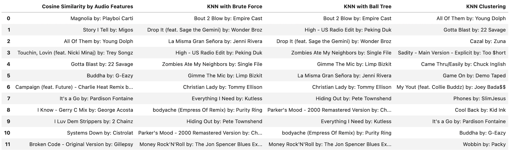
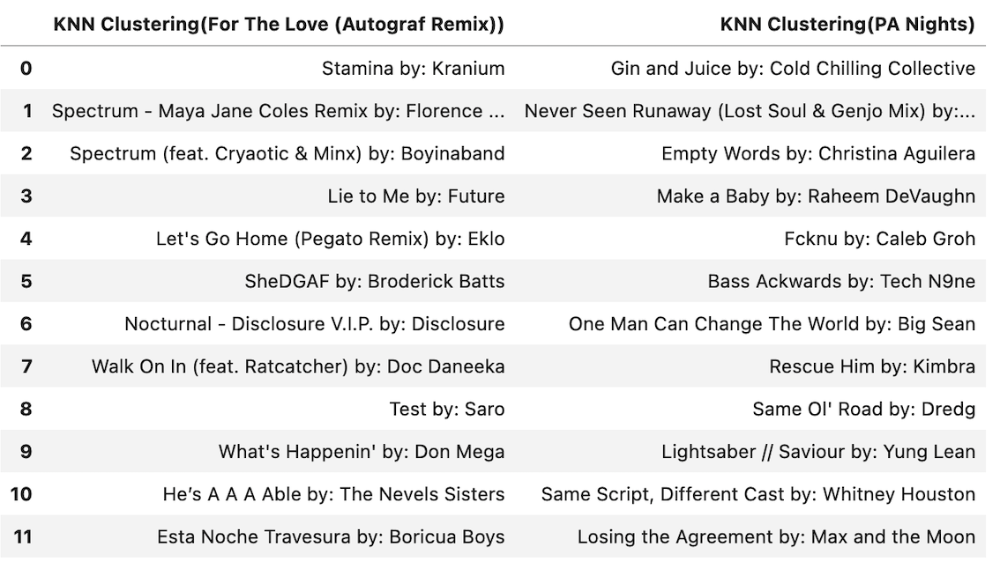

# Spotify Song Recommendation System based on Audio Features

# Background
I have been an avid music listener my whole life which leads me to make tons of playlists on Spotify.
Creating Playlists manually can be very time consuming and inefficient. I have always wondered if there was a way to make a playlist based on the mood of a song and unfortunately spotify doesnt have an option for that. So I wanted to create a recommendation system that can take an artist and various audio features such as tempo, valence(vibe), danceability of a song to create automatic playlists. I Am My own stakeholder but this can also be helpful to other enthusiasts like me out there.

# Overview
Give background as to why I chose Spotify, explain that they have huge database of 70 million songs. talk about their web api 

## Dataset Columns
- acosticness confidence measure from 0.0 to 1.0 of whether the track is acoustic.
- danceability measure describes how suitable a track is for dancing.
- duration_ms is the duration of the song track in milliseconds.
- energy represents a perceptual measure of intensity and activity.
- instrumentalness predicts whether a track contains vocals or not.
- loudness of a track in decibels(dB).
- liveness detects the presence of an audience in the recording.
- speechiness detects the presence of spoken words in a track
- time_signature is an estimated overall time signature of a track.
- key the track is in. Integers map to pitches using standard Pitch Class notation.
- valence (Vibe) measures from 0.0 to 1.0 describing the musical positiveness conveyed by a track.
- tempo is in beats per minute (BPM).
- mode (Melody) indicates the modality(major or minor) of the song.
- track_name is the name of the song.
- artist_Name is the singer of the song.

# Business Objective
Why Not Just Use Spotify Radio?
They do not allow you to use the features of tracks. When you get a spotify radio seperate playlist, you do not necessarily like all the songs that they do. Maybe you do wanted more danceable songs then songs with tempo that was given. Using the playlist creation feature that I have made, you can decide which types of songs you want to based on that song corresponding to the artist you like.


# Data
Data came from 2 sources:
 - API Calls of Spotify's [Web API](https://developer.spotify.com/documentation/web-api/) to get [audio features](https://developer.spotify.com/documentation/web-api/reference/#/operations/get-audio-features)
 - [The Spotify Million Playlist Dataset](https://www.aicrowd.com/challenges/spotify-million-playlist-dataset-challenge) which contained 1000 separate files
 filled with 1000 playlist each. I took a random sample of 10 files due to computational and time costs to use for my project.
 
 

# Methods
This project is only uses content-based filtering to create a recommendation system. Audio feature similarity is created using K-Nearest Neighbors(KNN) including Brute force, Clustering and Ball Tree, and Cosine-Similarity. Exploratory Data Analaysis was based on the sampled, final cleaned dataset.
Similarity


# Modeling
Used Cosine Similarity, KNN Brute Force, KNN Ball Tree, & K-Means Clustering to get a list of recommendations based on four audio features; valence, loudness,
danceability, and energy. expand The final dataset 12,000 songs with the audio features. It makes sense that loudness(dB) and energy are highly correlated and vibe & danceability are the second highly correlated sound propertiees. Clean up


# The Recommendations (Results)

- I modeled each model off the same song of "Magnolia" by Playboi Carti.
-Cosine Similarity & KNN Clustering recommendation lists sounded very similar to each other when I listened to them. Both nearest neighbor models were 
essentially similar to each other in terms of the names of tracks but when I listened to them they seemed completely out of sorts to each other. The mean distances between the features for both NN models were also extremely high (both over 1450 distance points) while KNN clustering was only 0.07 distance points.

# Conclusion
KNN Clustering model was the best based on my subjective hearing analysis. It had the lowest mean recommendation distance between selected features and it sounded the best. This model was also used on two other songs "(For The Love (Autograf Remix)" by GriZ and "PA Nights" by Mac Miller and both recommended lists sounded similar as well as their average distance between features (0.07 distance points) was identical with "Magnolia." 


# Limitations
 - Because the final dataset I modeled on was only about 12000 songs which is a severe lack of representation from Spotify's 70 million song database.
  
# Future Work
- Maybe add genres to dataset along with the other current audio features to see if recommendations improve. Also find out if there is a way to included
  more than one single artist and song to find similar songs.
- Create an app through [Flask](https://flask.palletsprojects.com/en/2.0.x/) or [Streamlit](https://streamlit.io/) to better visualize the recommendation
  systems.
- Make a collaborative-filtered Recommendation System based on what other users listen to compared to my own streaming history
- Make this same type of recommendation system I made with Spotify API with the [Apple Music API](https://developer.apple.com/documentation/applemusicapi/) as
  well.   
  
# Sources
- [How Spotify Recommends Your New Favorite Artist](https://towardsdatascience.com/how-spotify-recommends-your-new-favorite-artist-8c1850512af0)
- [Content-Based Recommendation System](https://medium.com/@bindhubalu/content-based-recommender-system-4db1b3de03e7)
- [Building a Song Recommendation System using Cosine Similarity and Euclidian Distance](https://medium.com/@mark.rethana/building-a-song-recommendation-system-using-cosine-similarity-and-euclidian-distance-748fdfc832fd)

# For More Information

Please review the full analysis in my [Jupyter Notebook](./jan13.ipynb) or [presentation deck](/Capstone_Presentation.pdf).

For additional questions, feel free to [contact me](https://www.linkedin.com/in/sumedh-bhardwaj-932767202/).

## Repository Structure
```
├── Data                                <- Both sourced externally and generated from code
├── Images                              <- Both sourced externally and generated from code
├── Notebooks                           <- Narrative documentation of analysis in Jupyter notebook
├── requirements.txt                    <- Requirements .txt file for reproducibility
├── Capstone_presentation.pdf           <- PDF version of project presentation
└── README.md                           <- The top-level README for reviewers of this project
