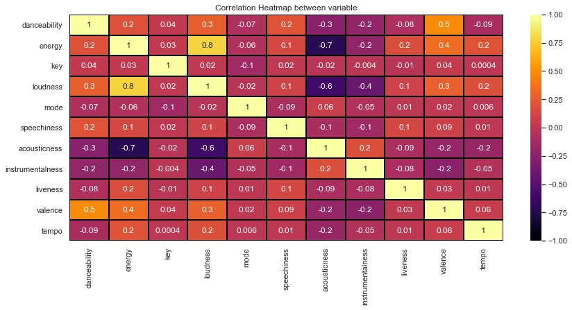

# Spotify Song Recommendation System based on Artists

# Background
I want to create a spotify playlist auto creator that would be able to take different artists based on your own music listening data while at the same time also adding a certain percentage of songs that you  like based on a recommendation system. Also if there would be a way to put a limit on the # of songs in a single playlist. Example, English Hip-Hop & Indian Music playlist  with 100 songs(including new recs).  Bc as of rn, everyone has to manually add music or create an auto playlist thats only similar to a specific datapoint such as (song name, artist, genre, album, etc) so if there way a way to make it seamless and easier to make a collection of the top say 50 hits for 2 genre/language(s) or more, I think it would be helpful to a lot.

# Overview

# Business Objective

# Data
Data came from 2 sources:
 - API Calls of Spotify's [Web API](https://developer.spotify.com/documentation/web-api/) to get [audio features](https://developer.spotify.com/documentation/web-api/reference/#/operations/get-audio-features)
 - [The Spotify Million Playlist Dataset](https://www.aicrowd.com/challenges/spotify-million-playlist-dataset-challenge) which contained 1000 separate files
 filled with 1000 playlist each. I took a random sample of 10 files due to computational and time costs to use for my project.

# Methods
This project is only uses content-based filtering to create a recommendation system. Audio feature similarity is created using K-Nearest Neighbors(KNN) including Brute force, Clustering and KD Tree, and Cosine-Similarity. Exploratory Data Analaysis was based on the sampled, final cleaned dataset.
Similarity

# Results
The final dataset 12,000 songs with the audio features. It makes sense that loudness and energy are highly correlated and valence & danceability are the second highly correlated sound propertiees.


# Modeling

# The Recommendations

# Conclusion

# Limitations
 - Because the final dataset I modeled on was only about 12000 songs which is a severe lack of representation from Spotify's 70 million song database.
  
# Future Work
- Maybe add genres to dataset along with the other current audio features to see if recommendations improve. Also find out if there is a way to included
  more than one single artist and song to find similar songs.
- Create an app through [Flask](https://flask.palletsprojects.com/en/2.0.x/) or [Streamlit](https://streamlit.io/) to better visualize the recommendation
  systems.
- Make a collaborative-filtered Recommendation System based on what other users listen to compared to my own streaming history

# For More Information

Please review the full analysis in my [Jupyter Notebook](./jan13.ipynb) or [presentation deck](/Capstone_Presentation.pdf).

For additional questions, feel free to [contact me](https://www.linkedin.com/in/sumedh-bhardwaj-932767202/).

## Repositiory Structure
```
├── Data                                <- Both sourced externally and generated from code
├── Images                              <- Both sourced externally and generated from code
├── Notebooks                           <- Narrative documentation of analysis in Jupyter notebook
├── requirements.txt                    <- Requirements .txt file for reproducibility
├── Capstone_presentation.pdf           <- PDF version of project presentation
└── README.md                           <- The top-level README for reviewers of this project
