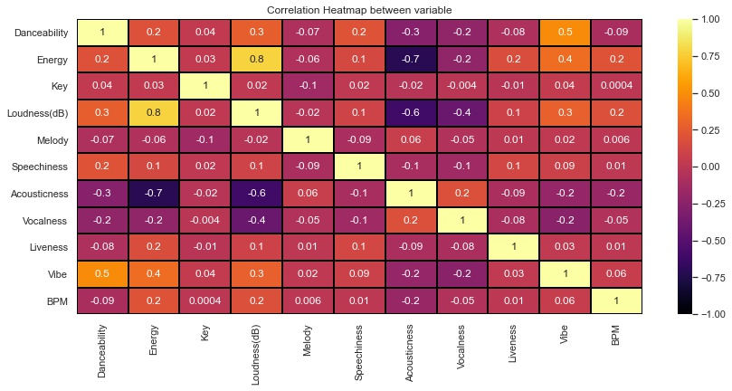
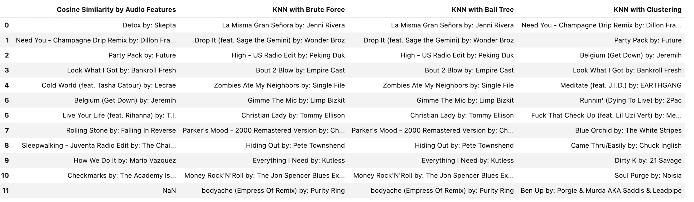

# Spotify Song Recommendation System based on Artists

# Background
I have been an avid music listener my whole life which leads me to make tons of playlists on Spotify.
Creating Playlists manually can be very time consuming and inefficient. I have always wondered if there was a way to make a playlist based on the mood of a song and unfortunately spotify doesnt have an option for that. So I wanted to create a recommendation system that can take an artist and various audio features such as tempo, valence(vibe), danceability of a song to create automatic playlists. I Am My own stakeholder but this can also be helpful to other enthusiasts like me out there.

# Overview

# Business Objective
Why Not Just Use Spotify Radio?
They do not allow you to use the features of tracks. When you get a spotify radio seperate playlist, you do not necessarily like all the songs that they do. Maybe you do wanted more danceable songs then songs with tempo that was given. Using the playlist creation feature that I have made, you can decide which types of songs you want to based on that song corresponding to the artist you like.


# Data
Data came from 2 sources:
 - API Calls of Spotify's [Web API](https://developer.spotify.com/documentation/web-api/) to get [audio features](https://developer.spotify.com/documentation/web-api/reference/#/operations/get-audio-features)
 - [The Spotify Million Playlist Dataset](https://www.aicrowd.com/challenges/spotify-million-playlist-dataset-challenge) which contained 1000 separate files
 filled with 1000 playlist each. I took a random sample of 10 files due to computational and time costs to use for my project.

# Methods
This project is only uses content-based filtering to create a recommendation system. Audio feature similarity is created using K-Nearest Neighbors(KNN) including Brute force, Clustering and KD Tree, and Cosine-Similarity. Exploratory Data Analaysis was based on the sampled, final cleaned dataset.
Similarity

# Results
The final dataset 12,000 songs with the audio features. It makes sense that loudness(dB) and energy are highly correlated and vibe & danceability are the second highly correlated sound propertiees.


# The Recommendations


# Modeling

# Conclusion

# Limitations
 - Because the final dataset I modeled on was only about 12000 songs which is a severe lack of representation from Spotify's 70 million song database.
  
# Future Work
- Maybe add genres to dataset along with the other current audio features to see if recommendations improve. Also find out if there is a way to included
  more than one single artist and song to find similar songs.
- Create an app through [Flask](https://flask.palletsprojects.com/en/2.0.x/) or [Streamlit](https://streamlit.io/) to better visualize the recommendation
  systems.
- Make a collaborative-filtered Recommendation System based on what other users listen to compared to my own streaming history

# For More Information

Please review the full analysis in my [Jupyter Notebook](./jan13.ipynb) or [presentation deck](/Capstone_Presentation.pdf).

For additional questions, feel free to [contact me](https://www.linkedin.com/in/sumedh-bhardwaj-932767202/).

## Repositiory Structure
```
├── Data                                <- Both sourced externally and generated from code
├── Images                              <- Both sourced externally and generated from code
├── Notebooks                           <- Narrative documentation of analysis in Jupyter notebook
├── requirements.txt                    <- Requirements .txt file for reproducibility
├── Capstone_presentation.pdf           <- PDF version of project presentation
└── README.md                           <- The top-level README for reviewers of this project
